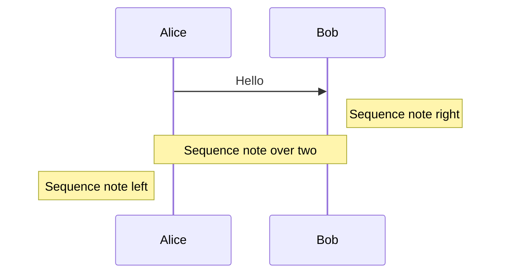
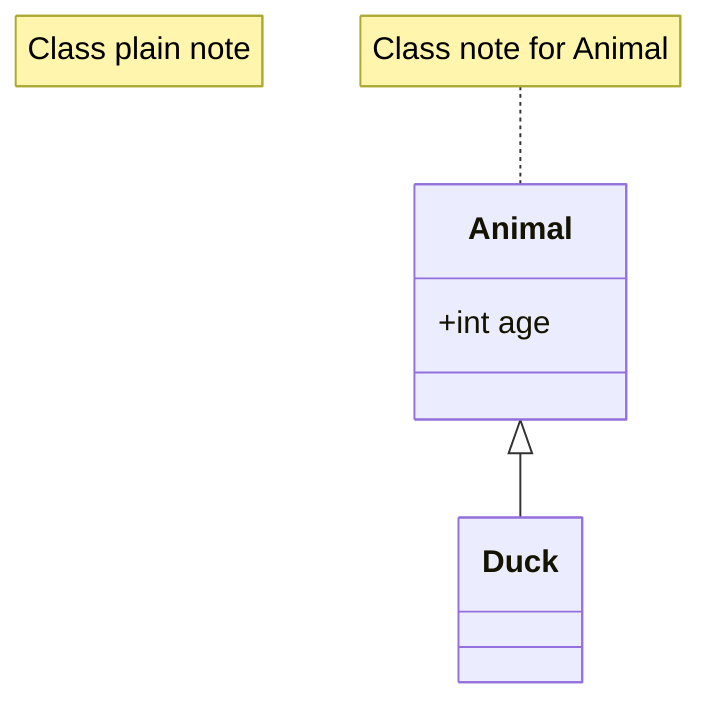
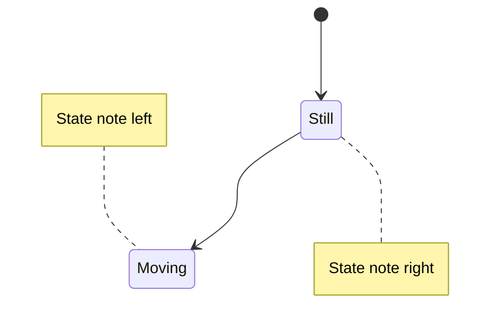
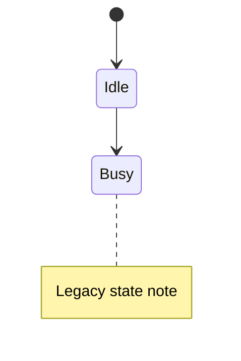

# Mermaid notes

One note of every kind Mermaid draws, for the BUG-069 contrast check.

## Sequence

```mermaid
sequenceDiagram
  participant A as Alice
  participant B as Bob
  A->>B: Hello
  Note right of B: Sequence note right
  Note over A,B: Sequence note over two
  Note left of A: Sequence note left
```

## Class

```mermaid
classDiagram
  note "Class plain note"
  class Animal
  note for Animal "Class note for Animal"
  Animal : +int age
  Animal <|-- Duck
```

## State

```mermaid
stateDiagram-v2
  [*] --> Still
  Still --> Moving
  note right of Still : State note right
  note left of Moving : State note left
```

## State (legacy keyword)

```mermaid
stateDiagram
  [*] --> Idle
  Idle --> Busy
  note right of Busy : Legacy state note
```
